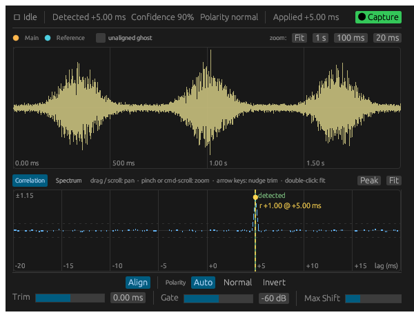

# ConjureAlign

A free VST3 / CLAP / AudioUnit plugin that automatically time-aligns two recordings of the same source
captured by different microphones — e.g., a close mic and a room mic on one guitar amp —
eliminating the phase cancellation and comb filtering caused by the distance between them.
Sub-sample precision, automatic polarity detection, and support for *negative* shifts
(moving a track earlier) via latency compensation.

The plugin window shows both captured waveforms overlaid (the main signal slides as the
alignment changes) and the cross-correlation curve with a marker at the detected peak plus a
live marker that tracks the applied shift. All graphs share one gesture set: drag or scroll
to pan, pinch or Ctrl-scroll to zoom, double-click to fit. Manual Trim is adjusted with its
slider, or with ←/→ while hovering a graph (0.01 ms per tap; hold Shift for 0.1 ms) — the arrow
keys need the plugin window to have keyboard focus, which in Logic means clicking the editor
once first.



## Installation (macOS)

Download `ConjureAlign-<version>-macOS.pkg` from the
[latest release](https://github.com/michaeljancsy/ConjureAlign/releases/latest) and
double-click it. The installer is signed and notarized; it offers all three formats —
**Audio Unit** (Logic Pro, GarageBand), **VST3** (REAPER, Ableton Live, Cubase, Studio
One), **CLAP** (Bitwig, REAPER) — and puts them in the system plug-in folders
(`/Library/Audio/Plug-Ins`). Click Customize to install only some of them. Restart your
DAW afterwards; in Logic the plugin appears under Audio FX → ConjureDSP → ConjureAlign.

If you previously copied the bundles into `~/Library/Audio/Plug-Ins` by hand, delete
those copies so your DAW doesn't keep loading the old version.

## Installation (Windows — beta)

Download `ConjureAlign-<version>-Windows.zip` from the
[latest release](https://github.com/michaeljancsy/ConjureAlign/releases/latest), unzip it,
and copy `ConjureAlign.vst3` to `C:\Program Files\Common Files\VST3\` and
`ConjureAlign.clap` to `C:\Program Files\Common Files\CLAP\` (there is no Audio Unit build —
that format is macOS-only). Restart your DAW and rescan plugins if it doesn't appear.

The Windows build passes the full DSP test suite, pluginval at strictness 10, and CLAP
validation automatically on every release, but it has had far less real-DAW testing than
the macOS build — [reports of anything odd](https://github.com/michaeljancsy/ConjureAlign/issues)
are genuinely useful, especially about the plugin window.

## Updates

ConjureAlign can tell you when a newer version is out. It asks once — in the same first-run
prompt as the privacy question, and as a separate question — and if you say yes it checks
[the releases page](https://github.com/michaeljancsy/ConjureAlign/releases/latest) about
once a day. When there is something new, the **⚙** button in the plugin's control bar reads
**⚙ Update**; click it for the version and a link to the release notes. "Skip this version"
silences one release without silencing the next.

It never downloads or installs anything — updating means downloading the new installer and
running it, exactly like the first time. You can check by hand at any time under **⚙ → Check
now**, whatever you answered, and you can change the answer there too.

If you say no, or never open the plugin window, no check ever happens.

## How to use it

1. Put **ConjureAlign on the track you want to shift** (usually the more distant mic).
2. Route the **reference track into the plugin's sidechain** ("Reference") input:
   - **REAPER**: open the plugin's pin connector, add inputs 3/4, send the reference track there.
   - **Ableton Live** (VST3): choose the reference track in the device header's sidechain chooser.
   - **Bitwig** (CLAP): same, via the device's sidechain chooser.
   - **Logic Pro** (AU): open the **Side Chain** menu at the top right of the plugin
     window's header and pick the reference track. If the track isn't listed, send it to a
     bus and pick the bus instead.
3. **Play a loud, representative section** of the song.
4. While it plays, **click "Capture"** in the plugin window (or toggle the "Capture"
   parameter on, e.g. from host automation). The plugin records a few seconds of both
   signals, measures the offset by cross-correlation, and glides click-free onto the
   corrected alignment. The waveforms, correlation curve, detected offset, polarity, and
   confidence appear in the window, and the result is stored with your session.
5. To re-analyze, click Capture again (or toggle the parameter off and on).

### Parameters

| Parameter | What it does |
|---|---|
| Capture | Rising edge starts a capture + analysis. Toggle off/on to re-run. |
| Alignment On | Bypass the correction without changing latency, for honest A/B comparison. |
| Polarity | Auto (use detected), Normal, or Inverted. |
| Manual Trim | ±10 ms added on top of the detected offset. |
| Max Shift | Search window and reported latency (10–200 ms). Takes effect on next plugin activation (e.g., session reload). |
| Capture Time | 1/2/4 s of audio analyzed per capture. |

Captures made during silence, or where the two signals don't actually correlate, are rejected
and the previous alignment is kept.

**A note on null tests**: if you verify alignment by inverting and summing, whole-sample
offsets null below −80 dB, but *fractional* offsets only null to around −20…−30 dB broadband —
the residual is entirely above ~19 kHz, where fractional delay is mathematically impossible for
any plugin. In the audible band the null is −70 dB or deeper (measured in
`tests/null_depth.rs`). A lowpass at ~19 kHz on the null bus shows the true audible-band depth.

## Privacy

The first time you open its window, ConjureAlign asks you two questions, and does nothing
until you answer either one. **Both are off unless you say yes.** There is no account, no
login, and nothing tied to you.

**1. Share anonymous usage and crash data?** Covers both usage analytics and crash reports —
one question, one answer. Everything sent carries a random ID generated on the machine when
you opt in.

A crash report names code inside ConjureAlign's *own* binary — its functions and those of the
open-source libraries compiled into it, with source paths as they were on the build machine,
never yours. It carries nothing from your machine: the list of other plugins loaded
alongside it is stripped before sending, and so is your computer's name.

**2. Check for new versions?** A separate question, because it shares no data and creates no
identifier. Once a day the plugin asks GitHub for the number of the latest release — nothing
more. There is no ID, no usage information and no payload; GitHub sees the request the way it
would see your browser opening the releases page. The reply is read for a version number and
nothing else, and the link the plugin offers is a fixed address compiled into it, never one
that arrived over the network.

Change either answer at any time with the **⚙** button in the plugin's control bar. Both are
stored in `~/Library/Application Support/ConjureDSP/ConjureAlign/analytics.json` on macOS and
`%APPDATA%\ConjureDSP\ConjureAlign\analytics.json` on Windows; deleting that file makes the
plugin ask again. Declining stores the "no" and nothing else — no ID is generated. If you
never open the editor (running headless from the host's generic parameter UI), you are never
asked, and nothing is sent or fetched. All three features are compiled out entirely on
platforms other than macOS and Windows.

The code is all in [`src/analytics.rs`](src/analytics.rs), [`src/crash.rs`](src/crash.rs) and
[`src/update.rs`](src/update.rs). The usage payload is built in one function
(`build_payload`), every crash report passes through one more (`scrub`) on its way out, and
the update check reads exactly one field of one document (`parse_release`) — if you want to
read precisely what leaves the machine.

The Audio Unit build is produced by [clap-wrapper](https://github.com/free-audio/clap-wrapper),
which re-exports the CLAP plugin behind an AU entry point. It carries a local patch so that
both the mono and stereo layouts are reachable from AU hosts — without it Logic hides the
plugin on mono tracks. See `deps/PATCHES.md`.

## Building

Stable Rust required.

```bash
cargo xtask bundle conjure_align --release
```

Bundles appear in `target/bundled/`; on macOS copy `ConjureAlign.clap` to
`~/Library/Audio/Plug-Ins/CLAP/`, `ConjureAlign.vst3` to `~/Library/Audio/Plug-Ins/VST3/`, and
`ConjureAlign.component` to `~/Library/Audio/Plug-Ins/Components/`. After replacing an
installed `.component`, run `killall -9 AudioComponentRegistrar` and restart the host, or
macOS will keep serving the cached registration.

On Windows the same command produces `ConjureAlign.vst3` and `ConjureAlign.clap` (no AU —
that layer is macOS-only).

Run the DSP test suite with `cargo test --release`. To eyeball the GUI panels without a DAW,
`cargo run --example gui_preview --features gui-preview` renders them with synthetic data to
`gui_preview.png` / `gui_preview_zoom.png`, plus the whole editor (`_full`), the first-run
prompt (`_consent`) and the ⚙ popover with and without an update waiting
(`_settings_update`, `_settings`).

## License

GPL-3.0-or-later. Third-party components and their licenses are listed in
[THIRD-PARTY.md](THIRD-PARTY.md).
